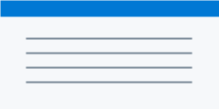

# MDpad Render Sample

This sample includes **bold**, _emphasis_, a [link](https://example.com), and inline math $x^2 + y^2 = z^2$.

## Tasks

- [x] Native Markdown pass
- [ ] Lazy math hydration
- [ ] Lazy image loading

## Table

| Feature | Status |
| --- | --- |
| Markdown | Ready |
| Code | Highlighted |

## Code

```js
const message = "hello markdown";
console.log(message);
```

## Display Math

$$
\int_0^1 x^2 dx = \frac{1}{3}
$$

## Image


